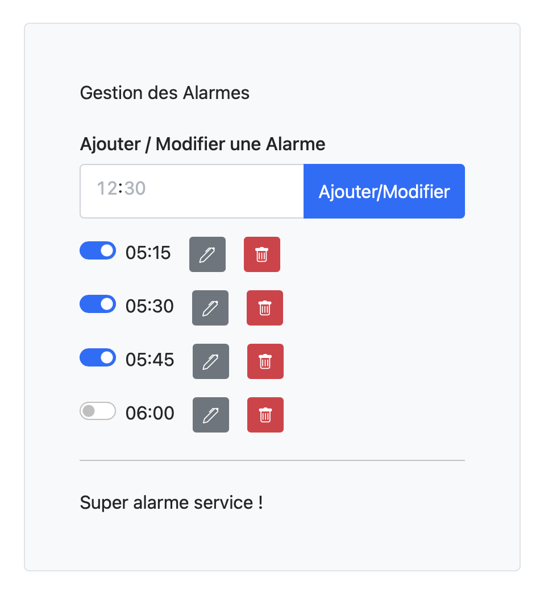

# TP02 - Réveil matin

## 1 - Directives

### 1.1 - Déroulement du TP

- Remise du travail : mercredi 11 février 2026, 23:59
- Ce travail est réalisé en équipe de 2 membres et seuls les membres de cette équipe y contribuent
- Vous devez utiliser votre dépôt Git pour faire votre travail : si une situation particulière est détectée, vos commits moduleront votre note dans le groupe
- Il en va de même pour le fichier Word contenant le rapport final du TP. Il doit être édité en collaboration via Sharepoint/Teams pour que l'historique des modifications puisse être consulté.
- Toutes les réponses fournies doivent être originales (produites par l’étudiant ou un membre de l’équipe)
- Toute copie de code, de portion de code, d’algorithme ou de texte doit faire mention de sa source
- L’emprunt ou la copie de code ou de portions de code est interdite
- L'utilisation de l'IA est considérée comme du plagiat si non documentée en tant que source
- Tout code copié mais documenté comme provenant d'une autre source sera noté à 0 mais ne sera pas considéré comme du plagiat
- Tout constat de plagiat, tricherie ou fraude sera automatiquement déclaré à la Direction et les sanctions prévues seront appliquées

### 1.2 - À remettre sur la plateforme d'enseignement Léa

- Un document word contenant le détail du projet. Ce document doit être édité en collaboration via Sharepoint/Teams. Le document de base doit être celui déjà contenu dans votre canal Teams/Sharepoint nommé `Dossier_TP02.docx`. Une pénalité de 10 points sera appliquée si ce n'est pas respecté.
- Le registre des heures consacrées au projet, inclus dans le document word (avec les totaux par participant)
- Votre code source C++ avec la structure de PlatformIO
- Vous devez fournir le lien d'une vidéo de 5 minutes illustrant le circuit, le code et le fonctionnement :
  - La vidéo doit être déposée sur YouTube
  - En lien non listé
  - La vidéo doit être accessible jusqu'à un an après la remise du travail
  - La vidéo doit être en français

### 1.3 - Structure de la remise

- Vous devez remplir le fichier "AUTHORS.md" qui donne le nom et matricule des équipiers
- Votre code source doit être dans le répertoire  ```src``` du présent dépôt Git
- Le répertoire source doit suivre la structure d’un projet PlatformIO
- Le lien de la vidéo doit être indiqué dans le document word et dans le fichier "AUTHORS.md"
- Le répertoire ```documents``` doit contenir votre rapport final de TP

### 1.4 - Évaluation

L'évaluation du travail est effectuée par les enseignants de l'UE en se basant sur :

- L'historique de Git et de Teams/Sharepoint font office de référence pour évaluer la proportion du travail effectué par chaque équipier

- La qualité et le contenu du code source :

  - Conformité du code et des normes d'écriture utilisées dans le cours
  - Fonctionnalité du code
  - Facilité de lecture du code
  - Modularité
  - Modèle objet
  - Paramétrisation du code
  - Utilisation de constantes
  - Utilisation de fichiers de configuration
  - etc.

- La qualité et le contenu du document word :
  
  - Français
  - Schéma
  - Clarté et précision des explications
  - Mise en page
  - Page de présentation
  - etc.

- La qualité et le contenu de la présentation vidéo :

  - Vidéo
  - Audio
  - Explication orale
  - etc.

- Participation au code : la participation est évaluée en utilisant GitInspector. Chaque étudiant doit être au dessus de 45% de participation ou verra sa note ajustée. Les codes faits en classe lors des exercices sont enlevés des statistiques pour ne pas pénaliser le partenaire qui ne met pas son ancien code. (Ex. Bouton.\[h|cpp], DEL.\[h|cpp])

Tout partage de code, d'explications, de bouts de texte, etc. est considéré comme du plagiat. Pour plus de détails, consultez le site (et ses vidéos) [Sois intègre du Cégep de Sainte-Foy](http://csfoy.ca/soisintegre) ainsi que [l'article 6.1.12 de la PÉA](https://www.csfoy.ca/fileadmin/documents/notre_cegep/politiques_et_reglements/5.9_PolitiqueEvaluationApprentissages_2019.pdf)

Si vous utilisez un code donné en cours, n'oubliez pas de référencer son origine dans votre code.

## 2 - Description du projet

Ce projet est un réveil matin qui permet de programmer des alarmes à des heures
précises. Il se présente sous la forme d'un boîtier avec un afficheur 4 digits,
3 boutons et 2 DELs. Il propose aussi une interface série et une interface web
qui permettent de contrôler les alarmes.

Au déclenchement de l'alarme, une musique est démarrée. Les boutons permettent
de stopper la musique et de relancer l'alarme (Snooze) après un délai de 5
minutes, puis 3 minutes, puis au 1 minute (On veut vraiment le réveiller !). 

Pour arrêter définitivement l'alarme, il faut appuyer longuement sur le troisième
bouton pendant au moins 5 secondes.

### 2.1 - Démarrage du réveil

Au démarrage, le réveil se connecte sur le réseau WiFi et récupère l'heure
actuelle avec une requête NTP.

La configuration du WiFi se fait dans le fichier `config.h` qui n'est pas
versionné (donc dans le fichier .gitignore). Vous devez fournir un fichier
`config.h.template` qui contient les informations de connexion au réseau WiFi
ainsi que les instructions de création du fichier `config.h`.

Durant la connexion, l'afficheur 4 digits affiche une animation de 3 images qui
cyclent :

- les 4 segments d de chaque digit s'allument seuls
- les 4 segments g de chaque digit s'allument seuls
- les 4 segments a de chaque digit s'allument seuls

Si la connexion WiFi échoue ou dépasse 30 secondes, le réveil affiche 88:88
clignotant sur l'afficheur 4 digits à la fréquence de 1 Hz.

### 2.2 - Fonctionnement

Une fois démarré, le réveil affiche l'heure actuelle sur l'afficheur 4 digits de
l'ESP32. À l'appui du bouton 1, le réveil affiche la première alarme disponible.
Pour indiquer que l'affichage du 4 digits est en mode "Affichage d'alarmes", une
DEL verte clignote. Si l'alarme est activée, une DEL rouge est allumée.

À l'appui du bouton 1, le réveil affiche la prochaine alarme disponible. Une
fois arrivé à la dernière alarme, le réveil revient à l'affichage de la première
alarme.

À l'appui du bouton 2, le réveil active/désactive l'alarme affichée. Le nouveau
statut de l'alarme est indiqué par la DEL rouge. Plusieurs alarmes peuvent être
activées en même temps. (Plusieurs heures de réveil pour être sûr de se lever !
Heures de prises de médicaments, etc.)

À l'appui du bouton 3, le réveil sort du mode "Affichage d'alarmes" et revient à
l'affichage de l'heure actuelle.

Les alarmes sont enregistrées dans un fichier JSON de la mémoire flash de
l'ESP32.

### 2.3 - Atteinte de l'heure d'une alarme

Lorsque l'heure d'une alarme est atteinte, quelque soit l'action en cours, une
musique se déclenche et l'heure s'affiche. Les boutons permettent de stopper la
musique et de relancer l'alarme (Rappel/Snooze) après un délai de 5 minutes,
puis 3 minutes, puis toute les minutes (On veut vraiment le réveiller !). Pour
arrêter définitivement l'alarme, il faut appuyer longuement sur le troisième
bouton pendant au moins 5 secondes. L'alarme est alors considérée comme étant
"désactivée" (Elle doit être réactivée pour la journée suivante).

Deux DELS sont nécessaires. Durant la période de sélection de l'alarme, un DEL
verte clignote. Une DEL rouge est allumée lorsqu'une alarme est activée.

Lorsque l'heure de l'alarme est arrivée, une musique de l'alarme débute. Les
trois boutons peuvent arrêter la musique temporairement. L'alarme est relancée
(Snooze) après un délai de 5 minutes, puis 3 minutes, puis au 1 minute (On veut
vraiment le réveiller !). Pour arrêter définitivement l'alarme, il faut appuyer
longuement sur le troisième bouton pendant au moins 5 secondes.

### 2.4 - Interfaces de contrôle

#### 2.4.1 - Interface série

Le réveil doit aussi être accessible par le port série. Vous devez minimalement
proposer les commandes suivantes (Vous avez le droit d'utiliser la classe
"BasicCommandInterpretor du dépôt
https://github.com/PiFou86/420-W48-SF-Utilitaires-Demo/) :

- `alarme get` : affiche les alarmes par ordre croissant d'heure
- `alarme set hh:mm` : ajoute/active une alarme
- `alarme unset hh:mm` : désactive une alarme
- `alarme delete hh:mm` : supprime une alarme
- `alarme update hh:mm hh:mm` : modifie une alarme (ancienne heure, nouvelle heure)
- `help` : affiche les commandes disponibles
- `time` : affiche l'heure actuelle
- `network` : affiche les informations de connexion WiFi
- `reboot` : redémarre le réveil

#### 2.4.2 - Interface web

Un contrôle à distance propose une page web qui :

- Affiche les alarmes par ordre croissant d'heure
- Permet d'activer / désactiver une alarme
- Permet d'ajouter/modifier des alarmes
- Permet de supprimer des alarmes

Remarque vous devez empêcher deux alarmes à la même heure.

Le site web doit utiliser les technologies et architectures suivantes :

- HTML
- CSS
- JavaScript
- AJAX
- REST

Voici un exemple de l'interface web :



### 2.5 - Bonus

- Une musique différente par alarme (Jusqu'à 5%)
- À votre imagination mais avec de la valeur ajoutée (Jusqu'à 5%) - La décrire dans le rapport

## 3 - Détail de l'évaluation

### 3.1 - Répartition des points

1. Document word (27%)

- Page de présentation (titre, auteurs, date, standard Cégep) et structure document (1%)
- Contexte du projet (1%)
- Planification, attribution des tâches (2%)
- Schéma du circuit électronique (3%)
- Dessin de montage sur plaque de circuit 3%)
- Diagramme de classes UML (5%)
- Inventaire des pièces avec estimation des coûts (3%)
- Estimation du courant utilisé par I/O et validation de la capacité du MCU (2%)
- Estimation énergétique : durée de vie des batteries / consommation si sur secteur (2%)
- Devis de tests manuels (5%)

2. Registre des heures consacrées au projet (2%)

Le registre doit indiquer la répartition des tâches. Le registre doit montrer les tâches respectives que chaque personne aura fait avec le nombre d’heures par tâche.

Il doit correspondre aux données collectées dans l'historique de Git et de Teams/Sharepoint de l'équipe.

3. Vidéo de 5-10 minutes illustrant le fonctionnement (9%)

- Présentation rapide du circuit (2%)
  - Présentation du circuit
  - Présentation du montage sur plaque de circuit
- Présentation rapide de la structure du code et des choix de conception (4%)
  - Déclenchement d'une alarme
  - Gestion du rappel
  - Serveur web
- Présentation du fonctionnement (3%)
  - Démarrage : Ok et erreur
  - Interface Web
  - Interface Série
  - Sonnerie
  - Rappel

1. Code (62%)

- Démarrage du programme - connexion WiFi (2%)
- Démarrage du programme - récupération de l'heure (2%)
- Affichage de l'heure actuelle (4%)
- Affichage des alarmes - Plaquette (4%)
- Activation/désactivation des alarmes - Plaquette (3%)
- Affichage des alarmes - Interface série (4%)
- Activation/désactivation des alarmes - Interface série (3%)
- Affichage des alarmes - Interface web (4%)
- Activation/désactivation des alarmes - Interface web (4%)
- Suppression des alarmes - Interface web (3%)
- Modification des alarmes - Interface web (3%)
- Alarme fonctionnelle (4%)
- Rappel/Snooze (4%)
- Arrêt définitif de l'alarme (4%)
- Sauvegarde des alarmes (4%)

5. Bonus: mise en oeuvre de choix de musiques différentes par l'alarme (Jusqu'à 5%)

6. Bonus: mise en oeuvre d'une fonction supplémentaire originale (Jusqu'à 5%)

### 3.2 - Critères appliqués durant l'évaluation

L'évaluation du travail est effectuée par le(s) enseignant(s) de l'UE en se basant sur :

- L'historique de Git et de Teams/Sharepoint font office de référence pour évaluer la proportion du travail effectué par chaque équipier

- La qualité et le contenu du code source :

  - Conformité du code et des normes d'écriture utilisées dans le cours
  - Respect des bonnes pratiques de programmation
  - Fonctionnalité du code (tous les modes fonctionnent correctement)
  - Facilité de lecture du code (noms explicites, structure claire du code et des fichiers)
  - Modularité et utilisation adéquate de la POO (classes, encapsulation, héritage si approprié)
  - Qualité du modèle objet (responsabilités claires, couplage faible)
  - Paramétrisation du code (constantes pour les temps, pins, seuils)
  - Utilisation de constantes (pas de nombres magiques)
  - Gestion appropriée de la mémoire (pas de fuites, optimisation pour Arduino)
  - Bonne utilisation des contraintes matérielles
  - Bonne utilisation des bibliothèques (PlatformIO, Arduino)
  - Gestion des états et transitions
  - Robustesse du code (gestion des cas limites)

- La qualité et le contenu du document word :
  
  - Qualité du français (orthographe, grammaire, syntaxe, vocabulaire technique)
  - Schéma électrique (clarté, précision, légende, respect des normes)
  - Diagramme de classes UML (complétude, clarté, respect de la notation UML)
  - Clarté et précision des explications techniques
  - Explication détaillée de la gestion des modes et transitions
  - Explication de la méthode de persistance des données
  - Explication de la méthode d'affichage des statistiques
  - Analyse des limites du système
  - Mise en page professionnelle (structure, hiérarchie, lisibilité)
  - Page de présentation complète (titre, auteurs, date, contexte)

- La qualité et le contenu de la présentation vidéo :

  - Qualité de l'image (résolution, stabilité, cadrage)
  - Qualité audio (clarté, volume, absence de bruits parasites)
  - Clarté des explications orales (français correct, débit adapté, vocabulaire technique)
  - Démonstration complète des trois modes (régulier, urgence, entretien)
  - Démonstration du cycle piéton avec appel
  - Démonstration des statistiques (affichage et réinitialisation)
  - Respect de la durée (~5 minutes, 10 minutes maximum)

- Participation au code : la participation est évaluée en utilisant GitInspector. Chaque étudiant doit être au dessus de 45% de participation ou verra sa note ajustée. Les codes faits en classe lors des exercices sont enlevés des statistiques pour ne pas pénaliser le partenaire qui ne met pas son ancien code. (Ex. Bouton.\[h|cpp], DEL.\[h|cpp], etc.)
- L'évaluation tient compte :
  - du style et de la structure du code : elle doit être similaire à celle proposée en cours
  - des pratiques de programmation apprises dans le programme doivent être appliquées
  - de la participation de chaque coéquipier avec la formule suivante : $ Min(100, note*50% + note*Min(50%, %participation))$, soit 50% de la note globale + %participation plafonné à 50% de la note globale. (Ex. note globale 110% et participation 50/50 : donne 100% à chaque personne, note globale 90 et participation 70/30 note : 90 et 72)
  - la participation est évaluée par les commits sur Git. Si une manipulation de l'historique est détectée, l'équipe sera pénalisée avec une participation maximale de 40% par partenaire. (Venir voir l'enseignant dès que détecté avant de tomber sur un problème au moment de la correction !). Actuellement, GitInspector est utilisé pour évaluer cette participation

Tout partage de code, d'explications, de bouts de texte, etc. est considéré comme du plagiat. Pour plus de détails, consultez le site (et ses vidéos) [Sois intègre du Cégep de Sainte-Foy](http://csfoy.ca/soisintegre) ainsi que [l'article 6.1.12 de la PÉA](https://www.csfoy.ca/fileadmin/documents/notre_cegep/politiques_et_reglements/5.9_PolitiqueEvaluationApprentissages_2019.pdf)

Si vous utilisez un code donné en cours, n'oubliez pas de référencer son origine dans votre code.

## 4 - Matériel dans l’inventaire de l’entreprise

Le budget se limite au matériel. Le temps alloué et le temps de montage sur plaque de circuit est exclus. Tous les prix sont fictifs.

Ajoutez des éléments et des prix au besoin (prix fictifs)

| Composant | Description | Nombre / lot | Prix ($ CAD)(*) |
| --- | --- | --- | --- |
| Arduino UNO | Microcontrôleur | 1 | 25,00 $ |
| DEL rouge 5mm | Haute luminosité | 1 | 0,10 $ |
| DEL jaune 5mm | Haute luminosité | 1 | 0,10 $ |
| DEL verte 5mm | Haute luminosité | 1 | 0,10 $ |
| Bouton poussoir | Normalement ouvert, momentané | 1 | 0,50 $ |
| Potentiomètre | 10 kΩ, rotatif | 1 | 0,75 $ |
| Résistance ¼ W | Jusqu’à 999 Ω | 4 | 0,15 $ |
| Résistance ¼ W | > 999 Ω | 4 | 0,35 $ |
| Fils cavaliers | Longueur/couleur variées | 4 | 0,05 $ |
| Natte Dupont | Mâle-Mâle | 4 | 0,15 $ |
| Natte Dupont | Mâle-Femelle | 4 | 0,15 $ |
| Natte Dupont | Femelle-Femelle | 4 | 0,15 $ |
| Plaquette pour soudure | Fabriquée selon schéma fourni | 1 | 5,00 $ |
| Afficheur Volt/Ampère | 0-99 V /0-2 A | 1 | 15,00$ |
| Alimentation 9V | Adaptateur secteur 1A | 1 | 5,00 $ |

(*) Tableau fictif, à des fins pédagogiques seulement

## 5 - Références

Il est conseillé d'utiliser les bibliothèques du cours suivantes :

- [Utilify](https://registry.platformio.org/libraries/sirdrako/Utilify) : Bibliothèque utilitaire pour Arduino et PlatformIO
- [UtilifyDigitalInput](https://registry.platformio.org/libraries/sirdrako/UtilifyDigitalInput) : Gestion des entrées numériques avec anti-rebond
- [UtilifyLogger](https://registry.platformio.org/libraries/sirdrako/UtilifyLogger) : Journalisation des événements pour Arduino
- [UtilifyAnalogInput](https://registry.platformio.org/libraries/sirdrako/UtilifyAnalogInput) : Gestion des entrées analogiques avec filtrage (Joystick, potentiomètre, etc.)
